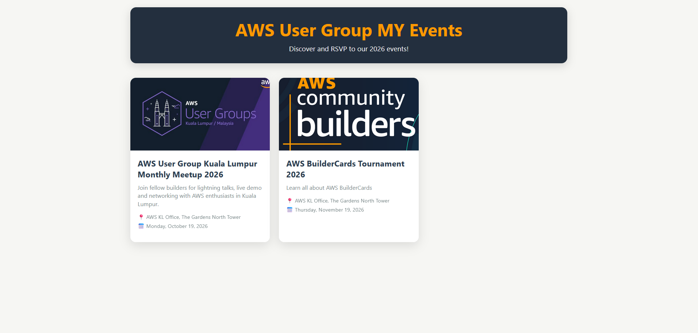
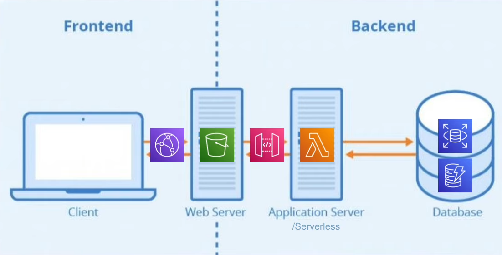

# Serverless Event RSVP App on AWS

A simple full-stack, serverless event RSVP web application built to gain hands-on AWS experience. It uses a cost-effective, scalable architecture built entirely on AWS Free Tier services.

## 🙏 Acknowledgements

Kudos to [@darladvd](https://github.com/darladvd) for the excellent guide! This project was built following the [Event RSVP AWS Tutorial](https://github.com/darladvd/event-rsvp-aws-tutorial/tree/master).

## App & Architecture Preview



**Flow:** Frontend → API Gateway → Lambda → MySQL (RDS) + DynamoDB → S3 + CloudFront



## Tech Stack
- **Frontend**: HTML, CSS, JavaScript
- **Backend**: Node.js (AWS Lambda)
- **Databases**: MySQL (Amazon RDS) + Amazon DynamoDB
- **Hosting & CDN**: Amazon S3 + Amazon CloudFront

## What I Learned
Through this project, I got my hands dirty with several core AWS services and figured out how they all connect. Some of the main takeaways include:
- Figuring out how to stick to the Free Tier by setting up AWS Budget Alarms early on.
- Writing IAM Roles and Policies from scratch so the backend services could talk to each other securely.
- Getting practical experience with both SQL (RDS) and NoSQL (DynamoDB) databases in the same project.
- Connecting a frontend UI to a serverless backend using API Gateway and Lambda functions.
- Throwing the frontend code into an S3 bucket and serving it over a fast CDN using CloudFront.

## Deployment

Need help deploying this project? Check out the [Deployment Guide](./DEPLOYMENT_GUIDE.md) for step-by-step instructions on setting up Lambda, API Gateway, S3, and CloudFront.

## Project Structure

```text
.
├── assets/
│   ├── index.png                # Home Page UI
│   └── fullstack-architecture.png # Architecture Diagram
├── index.html           # Main UI
├── style.css            # Styling
├── app.js               # Entry script
├── events.js            # Event logic + modal + RSVP
├── utils.js             # API helpers & formatters
├── index.js             # Lambda backend handler
├── db-creation.txt      # SQL Commands
└── package.json         # Node.js dependencies
```
